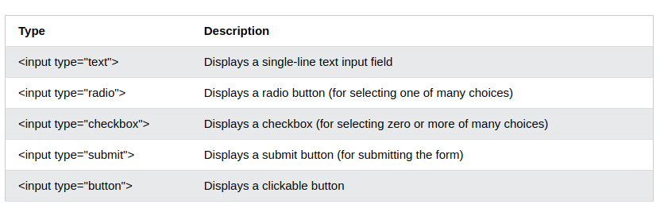
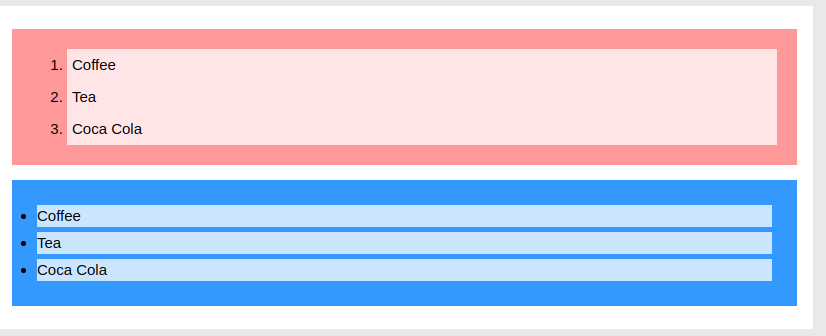
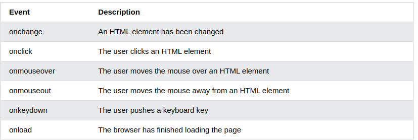

# HTML, CSS and JavaScript
## Forms in HTML 
**The `<form>` Element**

- The HTML `<form>` element is used to create an HTML form for user input.

- The `<form>` element is a container for different types of input elements, such as: text fields, checkboxes, radio buttons, submit buttons, etc.

*How Forms Work ?*
1. A user fills in a form and then presses a button to submit the information to the server.
2. The name of each form control is sent to the server along with the
value the user enters or selects.
3. The server processes
the information using a
programming language
such as PHP, C#, VB.net,
or Java. It may also store
the information in a
database.
4. The server creates a new
page to send back to the
browser based on the
information received.

**The `<input>` Element**

- The HTML `<input>` element is the most used form element.

- An `<input>` element can be displayed in many ways, depending on the type attribute.

**Password Input**
*type="password"*

When the type attribute has
a value of password it creates
a text box that acts just like a
single-line text input, except
the characters are blocked out.
They are hidden in this way so
that if someone is looking over
the user's shoulder, they cannot
see sensitive data such as
passwords.

### Drop down List box

**`<select>`**

A drop down list box (also
known as a select box) allows
users to select one option from a
drop down list.
The `<select>` element is used
to create a drop down list box. It
contains two or more `<option>`
elements. 

**`<option>`**
The `<option>` element is used
to specify the options that the
user can select from. The words
between the opening `<option>`
and closing `</option>` tags will
be shown to the user in the drop
down box.

### File Input Box

`<input>`

If you want to allow users to
upload a file (for example an
image, video, mp3, or a PDF),
you will need to use a file input
box.

**type="file"**

This type of input creates a
box that looks like a text input
followed by a browse button.
When the user clicks on the
browse button, a window opens
up that allows them to select a
file from their computer to be
uploaded to the website.

**Submit Button**

`<input>`

**type="submit"**

- The submit button is used to
send a form to the server.

- **name**
It can use a name attribute but it
does not need to have one.
- **value** The value attribute is used to
control the text that appears
on a button. 

## Form Validation

- You have probably seen forms
on the web that give users
messages if the form control has
not been filled in correctly; this is
known as form validation.
- Traditionally, form validation
has been performed using
JavaScript (which is beyond the
scope of this book). 
- Validation helps ensure the
user enters information in a
form that the server will be able
to understand when the form
is submitted. Validating the
contents of the form before it is
sent to the server the helps: 

1. Reduce the amount of work
the server has to do
2. Enables users to see if there
are problems with the form
faster than if validation were
performed on the server.

**Email and URL input**

**type="email"**

If you ask a user for an email
address, you can use the email
input. Browsers that support
HTML5 validation will check
that the user has provided
information in the correct format
of an email address. Some smart
phones also optimize their
keyboard to display the keys you
are most likely to need when
entering an email address (such
as the @ symbol).

## Lists, Tables and Forms in CSS

### Styling Lists

**Remove Default Settings**

The list-style-type:none property can also be used to remove the markers/bullets. Note that the list also has default margin and padding. To remove this, add margin:0 and padding:0 to `<ul>` or `<ol>`

**List shorthand property**

The list-style property is a shorthand property. It is used to set all the list properties in one declaration

**Styling List With Colors**

- We can also style lists with colors, to make them look a little more interesting.

- Anything added to the `<ol>` or `<ul>` tag, affects the entire list, while properties added to the `<li>` tag will affect the individual list items:

ol {
  
  background: #ff9999;
  
  padding: 20px;
}

ul {
  
  background: #3399ff;
  
  padding: 20px;
}

ol li {
  
  background: #ffe5e5;

  padding: 5px;

  margin-left: 35px;
}

ul li {
  
  background: #cce5ff;
  
  margin: 5px;
}

the result will be :

### Styling tables with CSS

**Table Borders**

- To specify table borders in CSS, use the border property.

- The example below specifies a black border for `<table>`, `<th>`, and `<td>` elements:

`table, th, td {`
  
  `border: 1px solid black;`

`}`

**Full-Width Table**

The table above might seem small in some cases. If you need a table that should span the entire screen (full-width), add width: 100% to the `<table>` element:

`table {`
  `width: 100%;`
`}`

**Collapse Table Borders**

The border-collapse property sets whether the table borders should be collapsed into a single border

### Styling Forms with CSS

**Styling Input Fields**

Use the width property to determine the width of the input field, for example:

input {
  width: 100%;
}

*The example above applies to all `<input>` elements. If you only want to style a specific input type, you can use attribute selectors:*

- input[type=text] - will only select text fields
- input[type=password] - will only select password fields
- input[type=number] - will only select number fields

**Padded Inputs**

Use the padding property to add space inside the text field.

Tip: When you have many inputs after each other, you might also want to add some margin, to add more space outside of them

**Bordered Inputs**

Use the border property to change the border size and color, and use the border-radius property to add rounded corners

**Colored Inputs**

Use the background-color property to add a background color to the input, and the color property to change the text color

**Focused Inputs**

- By default, some browsers will add a blue outline around the input when it gets focus (clicked on). You can remove this behavior by adding outline: none; to the input.

- Use the :focus selector to do something with the input field when it gets focus

## JavaScript Events

- HTML events are "things" that happen to HTML elements.

- When JavaScript is used in HTML pages, JavaScript can "react" on these events.

### HTML Events
*An HTML event can be something the browser does, or something a user does.*

Here are some examples of HTML events:

- An HTML web page has finished loading
- An HTML input field was changed
- An HTML button was clicked
Often, when events happen, you may want to do something.

- JavaScript lets you execute code when events are detected.

H- TML allows event handler attributes, with JavaScript code, to be added to HTML elements.

**Common HTML events**

*What can JavaScript Do?*

**Event handlers can be used to handle and verify user input, user actions, and browser actions:**

- Things that should be done every time a page loads
- Things that should be done when the page is closed
- Action that should be performed when a user clicks a button
- Content that should be verified when a user inputs data

**Many different methods can be used to let JavaScript work with events:**

- HTML event attributes can execute JavaScript code directly
- HTML event attributes can call JavaScript functions
- You can assign your own event handler functions to HTML elements
- You can prevent events from being sent or being handled

### Reacting Events

*A JavaScript can be executed when an event occurs, like when a user clicks on an HTML element.*

**To execute code when a user clicks on an element, add JavaScript code to an HTML event attribute:**

`onclick=JavaScript`

Examples of HTML events:

- When a user clicks the mouse
- When a web page has loaded
- When an image has been loaded
- When the mouse moves over an element
- When an input field is changed
- When an HTML form is submitted
- When a user strokes a key

**Assign Events Using the HTML DOM**

The HTML DOM allows you to assign events to HTML elements using JavaScript:

``

**The onload and onunload Events**

- The onload and onunload events are triggered when the user enters or leaves the page.

- The onload event can be used to check the visitor's browser type and browser version, and load the proper version of the web page based on the information.

- The onload and onunload events can be used to deal with cookies.

**The onchange Event**

- The onchange event is often used in combination with validation of input fields.

- Below is an example of how to use the onchange. The upperCase() function will be called when a user changes the content of an input field.

