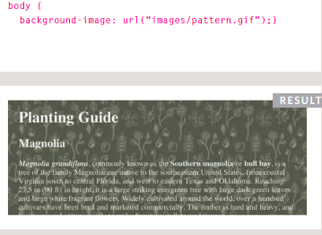
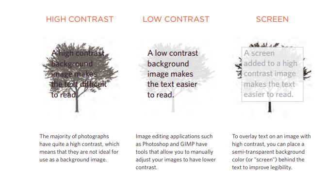
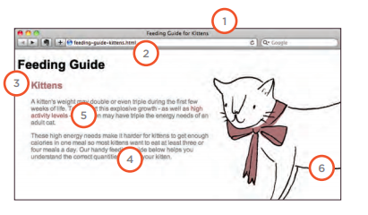

# CSS
## Styling Images in CSS 
*how can you change the size of an image in CSS?*

- You can control the size of an
image using the width and
height properties in CSS, just
like you can for any other box.
- Specifying image sizes helps
pages to load more smoothly
because the HTML and CSS
code will often load before the
images, and telling the browser
how much space to leave for an
image allows it to render the rest
of the page without waiting for
the image to download.

**Aligning Images in CSS**

Rather than using the 
element's align attribute, web
page authors are increasingly
using the float property to align
images. There are two ways that
this is commonly achieved:

1. The float property is added
to the class that was created to
represent the size of the image
(such as the small class in our
example).
2. New classes are created with
names such as align-left or
align-right to align the images
to the left or right of the page.
These class names are used in
addition to classes that indicate
the size of the image.

**Centering Images in CSS**

To center an image, set left and right margin to auto and make it into a block element:

`img {`

  `display: block;`

  `margin-left: auto;`

  `margin-right: auto;`
  
  `width: 50%;`

`}`

**Background Images**

- The background-image
property allows you to place
an image behind any HTML
element. This could be the entire
page or just part of the page. By
default, a background image will
repeat to fill the entire box.
- The path to the image follows
the letters url, and it is put
inside parentheses and quotes.

for example:

**Reapeating Images**

*The background-repeat property can have four values:*
1. repeat
The background image is
repeated both horizontally and
vertically (the default way it
is shown if the backgroundrepeat property isn't used).
2. repeat-x:
The image is repeated
horizontally only (as shown in
the first example on the left).
3. repeat-y:
The image is repeated vertically
only.
4. no-repeat:
The image is only shown once.

### Image Rollovers and Sprites:
- Using CSS, it is possible to create
a link or button that changes to a
second style when a user moves
their mouse over it (known as a
rollover) and a third style when
they click on it.
- This is achieved by setting a
background image for the link or
button that has three different
styles of the same button (but
only allows enough space to
show one of them at a time).
You can see the image we are
using in this example on the
right. It actually features two
buttons on the one image.
- When the user moves their
mouse over the element, or
clicks on it, the position of the
background image is moved to
show the relevant image.
- When a single image is used
for several different parts of an
interface, it is known as a **sprite**.

**Geadients**

 The
gradient is created using the
background-image property
and, at the time of writing,
different browsers required a
different syntax.
Since it is not supported by all
browsers, it is possible to specify
a background image for the box
first (which would represent the
gradient) and then provide the
CSS alternatives for browsers
that support gradients.

### Contrast of background images

## Practical Information

### Search Engine Optimization (SEO)

*SEO is a huge topic and several books have been written on the subject. The following pages will help you understand the key concepts so you can improve your website's visibility on search engines.*

**On-Page SEO**

*In every page of your website there are seven key places where keywords (the words people might search on to find your site) can appear in order to improve its findability*

1. Page Title:
The page title appears at the top
of the browser window or on the
tab of a browser.
2. URL / Web Address:
The name of the file is part of
the URL. 
3. Headings: If the keywords are in a heading `<hn>` element then a search
engine will know that this page is
all about that subject and give it
greater weight than other text.
4. Text:
Where possible, it helps to
repeat the keywords in the main
body of the text at least 2-3
times. 
5. Link Text:
Use keywords in the text that
create links between pages
6. Image Alt Text
Search engines rely on you
providing accurate descriptions
of images in the alt text. 

### Analytics: Learning about your Visitors

As soon as people start coming to your site, you can start analyzing
how they found it, what they were looking at and at what point they are
leaving.

1. Signing Up:
The Google Analytics service
relies on you signing up for an
account at:
www.google.com/analytics
The site will give you a piece of
tracking code which you need to
put on every page of your site.
2. How it Works:
Every time someone loads a
page of your site, the tracking
code sends data to the Google
servers where it is stored.
3. The Tracking Code:
A tracking code is provided
by Google Analytics for each
website you are tracking. 

### How Many People Are Coming to Your Site?

*The overview page gives you a snapshot of the key information you are likely to want to know. In particular, it tells you how many people are coming to your site.*

### What Are Your Visitors Looking At?

*The content link on the left-hand side allows you to learn more about what the visitors are looking at when they come to your site.*

### Domain Names & Hosting

- DOMAIN NAMES: 
Your domain name is your web
address (e.g. google.com or bbc.
co.uk). There are many websites
that allow you to register domain
names. Usually you will have to
pay an annual fee to keep that
domain name.
- Web Hosting : So that other people can see
your site, you will need to upload
it to a web server. Web servers
are special computers that are
constantly connected to the
Internet. They are specially set
up to serve web pages when
they are requested.

