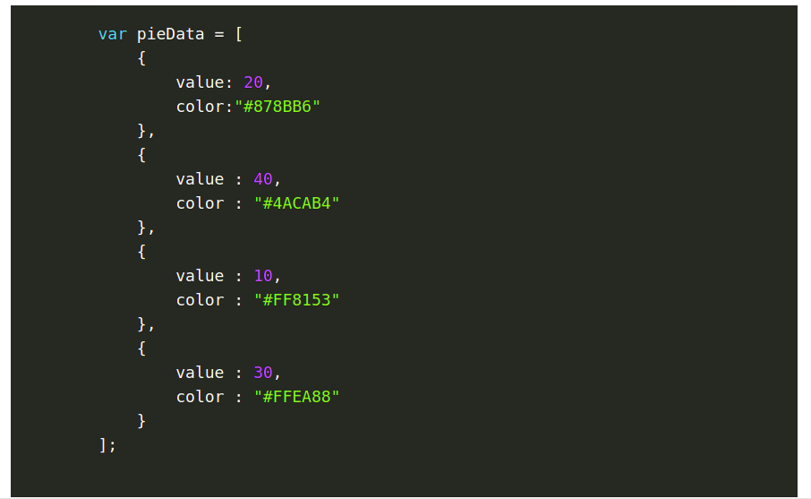
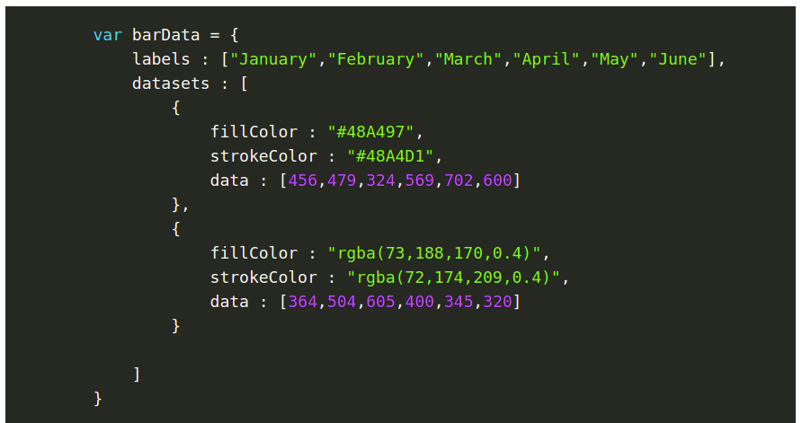
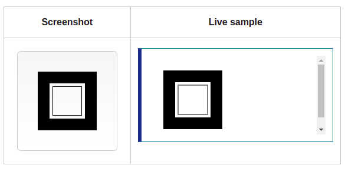
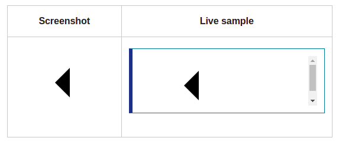

# Charts and Canvas
## Charts in JavaScript
*Charts are far better for displaying data visually than tables and have the added benefit that no one is ever going to press-gang them into use as a layout tool.*

to create a chart in JavaScript there are some steps you have to follow which are :
1. **Setting up :**
The first thing we need to do is download Chart.js. Copy the Chart.min.js out of the unzipped folder and into the directory you’ll be working in. Then create a new html page and import the script:

`<!DOCTYPE html>`

`<html lang="en">`

    `<head>`

        `<meta charset="utf-8" />`

        `<title>Chart.js demo</title>`

        ``
    
    `</head>`

    `<body>`

    `</body>`

`</html>`

2. **Drawing a line chart :**
To draw a line chart, the first thing we need to do is create a canvas element in our HTML in which Chart.js can draw our chart. So add this to the body of our HTML page:

`<canvas id="buyers" width="600" height="400"></canvas>`

Next, we need to write a script that will retrieve the context of the canvas, so add this to the foot of your body element:

``

3. **Drawing a pie chart :**
Our line chart is complete, so let’s move on to our pie chart. First, we need the canvas element:

`<canvas id="countries" width="600" height="400"></canvas>`

Next, we need to get the context and to instantiate the chart:

`var countries= document.getElementById("countries").getContext("2d");`

`new Chart(countries).Pie(pieData, pieOptions);`

Next we need to create the data. This data is a little different to the line chart because the pie chart is simpler, we just need to supply a value and a color for each section:

4. **Drawing a bar chart :**
Finally, let’s add  a bar chart to our page. Happily the syntax for the bar chart is very similar to the line chart we’ve already added. First, we add the canvas element:

`<canvas id="income" width="600" height="400"></canvas>`

Next, we retrieve the element and create the graph:

`var income = document.getElementById("income").getContext("2d");`

`new Chart(income).Bar(barData);`

And finally, we add in the bar chart’s data:

## Canvas Element

`<canvas id="tutorial" width="150" height="150"></canvas>`

*at first sight a `<canvas>` looks like the `` element, with the only clear difference being that it doesn't have the src and alt attributes. Indeed, the `<canvas>` element has only two attributes, width and height. These are both optional and can also be set using DOM properties. When no width and height attributes are specified, the canvas will initially be 300 pixels wide and 150 pixels high.*

**FallBack content**

*The `<canvas>` element differs from an `` tag in that, like for `<video>`, `<audio>`, or `<picture>` elements, it is easy to define some fallback content, to be displayed in older browsers not supporting it, like versions of Internet Explorer earlier than version 9 or textual browsers. You should always provide fallback content to be displayed by those browsers.*

For example, we could provide a text description of the canvas content or provide a static image of the dynamically rendered content. This can look something like this:

`<canvas id="stockGraph" width="150" height="150">`

  `current stock price: $3.15 + 0.15`

`</canvas>`

`<canvas id="clock" width="150" height="150">`

  ``

`</canvas>`

**Required `</canvas>` tag**

*As a consequence of the way fallback is provided, unlike the `` element, the `<canvas>` element requires the closing tag (`</canvas>`). If this tag is not present, the rest of the document would be considered the fallback content and wouldn't be displayed.*

**The rendering context**

*The `<canvas>` element creates a fixed-size drawing surface that exposes one or more rendering contexts, which are used to create and manipulate the content shown.*

**Checking for support**

*The fallback content is displayed in browsers which do not support `<canvas>`. Scripts can also check for support programmatically by testing for the presence of the getContext() method.*

### Drawing shapes with canvas

#### Drawing Rectangles 

`<canvas>` only supports two primitive shapes: rectangles and paths (lists of points connected by lines). All other shapes must be created by combining one or more paths. Luckily, we have an assortment of path drawing functions which make it possible to compose very complex shapes.

**First let's look at the rectangle. There are three functions that draw rectangles on the canvas:**

- **fillRect(x, y, width, height)**
Draws a filled rectangle.
- **strokeRect(x, y, width, height)**
Draws a rectangular outline.
- **clearRect(x, y, width, height)**
Clears the specified rectangular area, making it fully transparent.

for example :

`function draw() {`

  `var canvas = document.getElementById('canvas');`

  `if (canvas.getContext) {`

    `var ctx = canvas.getContext('2d');`

    `ctx.fillRect(25, 25, 100, 100);`
    
    `ctx.clearRect(45, 45, 60, 60);`
    
    `ctx.strokeRect(50, 50, 50, 50);`

  `}`

`}`

Results:

#### Drawing Paths

*A path, or even a subpath, can be closed. To make shapes using paths, we take some extra steps:*

1. First, you create the path.
2. Then you use drawing commands to draw into the path.
3. Once the path has been created, you can stroke or fill the path to render it.

Here are the functions used to perform these steps:

- **beginPath()**
Creates a new path. Once created, future drawing commands are directed into the path and used to build the path up.
- Path methods
Methods to set different paths for objects.
- **closePath()**
Adds a straight line to the path, going to the start of the current sub-path.
- **stroke()**
Draws the shape by stroking its outline.
- **fill()**
Draws a solid shape by filling the path's content area.

#### Drawing Triangles

*For example, the code for drawing a triangle would look something like this:*

`function draw() {`

  `var canvas = document.getElementById('canvas');`

  `if (canvas.getContext) {`

    `var ctx = canvas.getContext('2d');`

    `ctx.beginPath();`
    
    `ctx.moveTo(75, 50);`
    
    `ctx.lineTo(100, 75);`
    
    `ctx.lineTo(100, 25);`

    `ctx.fill();`

  `}`

`}`

Results:

