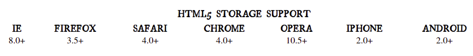
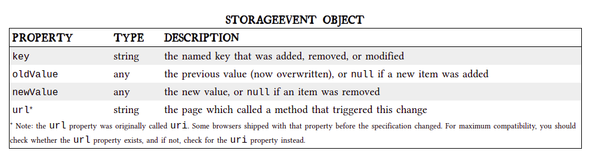
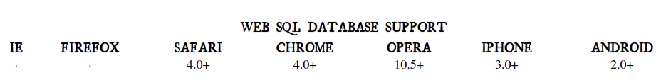

# LOCAL STORAGE FOR WEB APPLICATIONS

*persistent local storage is one of the areas where native client applications have held an advantage over web applications. For native applications, the operating system typically provides an abstraction layer for storing and retrieving application-specific data like preferences or runtime state.*

**Cookies were invented early in the web’s history, and indeed they can be used for persistent local storage of small amounts of data. But they have three potentially dealbreaking downsides:**

- Cookies are included with every HTTP request, thereby slowing down your web application by needlessly transmitting the same data over and over
- Cookies are included with every HTTP request, thereby sending data unencrypted over the internet (unless your entire web application is served over SSL)
- Cookies are limited to about 4 KB of data — enough to slow down your application (see above), but not enough to be terribly useful.

## A BRIEF HISTORY OF LOCAL STORAGE HACKS BEFORE HTML5
- userData allows web pages to store up to 64 KB of data per domain, in a hierarchical XML-based structure. IE does not present any form of permissions dialog, and there is no allowance for increasing the amount of storage available.
- then, Adobe introduced a feature in Flash 6 that gained the unfortunate and misleading name of “Flash cookies.” Within the Flash environment, the feature is properly known as Local Shared Objects. 
- after that, Google launched Gears, an open source browser plugin aimed at providing additional capabilities in browsers.

## INTRODUCING HTML5 STORAGE

*what is HTML5 Storage?*
 
 **Simply put, it’s a way for web pages to store named key/value pairs locally, within the client web browser. Like cookies, this data persists even after you navigate away from the web site, close your browser tab, exit your browser, or what have you.**

 every browser supports HTML5 Storage:

 

 *From your JavaScript code, you’ll access HTML5 Storage through the localStorage object on the global window object. Before you can use it, you should detect whether the browser supports it.*

 `function supports_html5_storage() {`

  `try {`
    
    `return 'localStorage' in window && window['localStorage'] !== null;`
  
  `} catch (e) {`
    
    `return false;`
  
  `}`

`}`

**Instead of writing this function yourself, you can use Modernizr to detect support for HTML5 Storage.**

## USING HTML5 STORAGE

HTML5 Storage is based on named key/value pairs. You store data based on a named key, then you can retrieve that data with the same key. The named key is a string. The data can be any type supported by JavaScript, including strings, Booleans, integers, or floats. However, the data is actually stored as a string. If you are storing and retrieving anything other than strings, you will need to use functions like parseInt() or parseFloat() to coerce your retrieved data into the expected JavaScript datatype.

## TRACKING CHANGES TO THE HTML5 STORAGE AREA

*The storage event is supported everywhere the localStorage object is supported, which includes Internet Explorer 8. IE 8 does not support the W3C standard addEventListener (although that will finally be added in IE 9). Therefore, to hook the storage event, you’ll need to check which event mechanism the browser supports.*

`if (window.addEventListener) {`

  `window.addEventListener("storage", handle_storage, false);`

`} else {`
  
  `window.attachEvent("onstorage", handle_storage);`

`};`

*The handle_storage callback function will be called with a StorageEvent object, except in Internet Explorer where the event object is stored in window.event.*

`function handle_storage(e) {`

  `if (!e) { e = window.event; }`

`}`

**At this point, the variable e will be a StorageEvent object, which has the following useful properties.**

## HTML5 STORAGE IN ACTION

*If your browser supports HTML5 Storage, the demonstration page should magically remember your exact position within the game, including the number of moves you’ve made, the position of each of the pieces on the board, and even whether a particular piece is selected.*

**How does it work? Every time a change occurs within the game, we call this function:**

`function saveGameState() {`

    `if(!supportsLocalStorage()){return false;}`

    `localStorage["halma.game.in progress"] = gGameInProgress;`

    for (var i = 0; i < kNumPieces; i++) {

	localStorage["halma.piece." + i + ".row"] = gPieces[i].row;

	localStorage["halma.piece." + i + ".column"] = gPieces[i].column;

    }

    localStorage["halma.selectedpiece"] = gSelectedPieceIndex;

    localStorage["halma.selectedpiecehasmoved"] = gSelectedPieceHasMoved;

    localStorage["halma.movecount"] = gMoveCount;

    return true;}

    
the localStorage object is used to save whether there is a game in progress (gGameInProgress, a Boolean). If so, it iterates through the pieces (gPieces, a JavaScript Array) and saves the row and column number of each piece.

## BEYOND NAMED KEY-VALUE PAIRS: COMPETING VISIONS

*While the past is littered with hacks and workarounds, the present condition of HTML5 Storage is surprisingly rosy. A new API has been standardized and implemented across all major browsers, platforms, and devices. As a web developer, that’s just not something you see every day, is it? But there is more to life than “5 megabytes of named key/value pairs,” and the future of persistent local storage is… how shall I put it… well, there are competing visions.*

**The Web SQL Database specification has been implemented by four browsers and platforms.**

This specification has reached an impasse: all interested implementors have used the same SQL backend (Sqlite), but we need multiple independent implementations to proceed along a standardisation path. Until another implementor is interested in implementing this spec, the description of the SQL dialect has been left as simply a reference to Sqlite, which isn't acceptable for a standard.

    