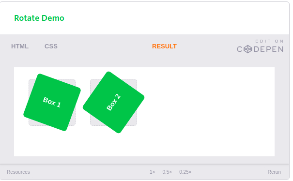
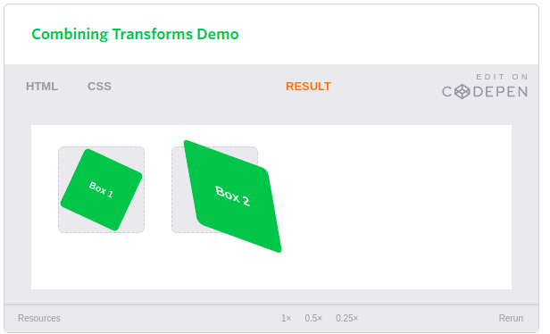
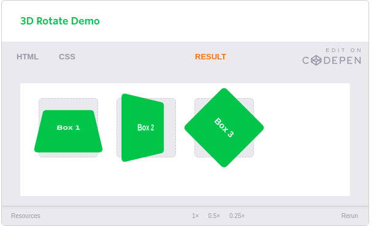
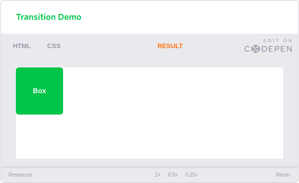
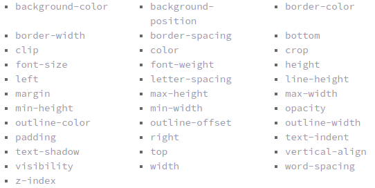
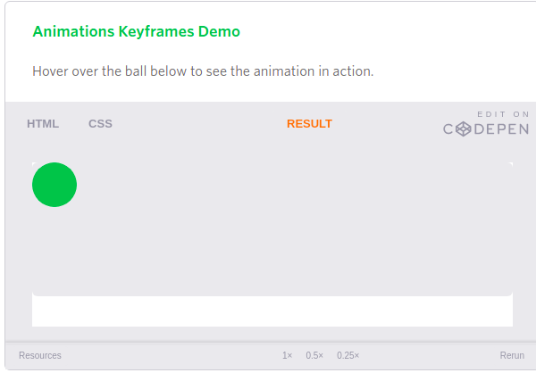

# CSS ANIMATION

## Transforms

*The transform property comes in two different settings, two-dimensional and three-dimensional. Each of these come with their own individual properties and values.*

**Transform Syntax:**

*The actual syntax for the transform property is quite simple, including the transform property followed by the value. The value specifies the transform type followed by a specific amount inside parentheses.*

`div {`

  `-webkit-transform: scale(1.5);`

     `-moz-transform: scale(1.5);`

       `-o-transform: scale(1.5);`

          `transform: scale(1.5);`

`}`

The transform property includes multiple vendor prefixes to gain the best support across all browsers. 

### 2D Transforms

Elements may be distorted, or transformed, on both a two-dimensional plane or a three-dimensional plane. Two-dimensional transforms work on the x and y axes, known as horizontal and vertical axes. Three-dimensional transforms work on both the x and y axes, as well as the z axis. 

#### 2D Rotate
The transform property accepts a handful of different values. for example:

**HTML**

`<figure class="box-1">Box 1</figure>`

`<figure class="box-2">Box 2</figure>`

              
**CSS**

`.box-1 {`

  `transform: rotate(20deg);`

`}`

`.box-2 {`

  `transform: rotate(-55deg);`

`}`

Results:

The gray box behind the rotated element symbolizes the original position of the element. Additionally, upon hover the box will rotate 360 degrees horizontally.

**2D Scale**

*Using the scale value within the transform property allows you to change the appeared size of an element. for example*

**HTML**

`<figure class="box-1">Box 1</figure>`

`<figure class="box-2">Box 2</figure>`

              
**CSS**

`.box-1 {`

  `transform: scale(.75);`

`}`

`.box-2 {`

  `transform: scale(1.25);`

`}`

Results:

**Combining Transforms**

*It is common for multiple transforms to be used at once, rotating and scaling the size of an element at the same time for example.*

**HTML**

`<figure class="box-1">Box 1</figure>`

`<figure class="box-2">Box 2</figure>`

              
**CSS**

`.box-1 {`

  `transform: rotate(25deg) scale(.75);`

`}`

`.box-2 {`

  `transform: skew(10deg, 20deg) translateX(20px);`

`}`

Results :

### 3D Transforms

**3D Rotate**

Using the rotateX value allows you to rotate an element around the x axis, as if it were being bent in half horizontally. Using the rotateY value allows you to rotate an element around the y axis, as if it were being bent in half vertically. Lastly, using the rotateZ value allows an element to be rotated around the z axis.

**HTML**

`<figure class="box-1">Box 1</figure>`

`<figure class="box-2">Box 2</figure>`

`<figure class="box-3">Box 3</figure>`

              
**CSS**

`.box-1 {`

  `transform: perspective(200px) rotateX(45deg);`

`}`

`.box-2 {`

  `transform: perspective(200px) rotateY(45deg);`

`}`

`.box-3 {`

  `transform: perspective(200px) rotateZ(45deg);`

`}`

Results:

## Transitions and Animations

### Transitions

There are four transition related properties in total, including transition-property, transition-duration, transition-timing-function, and transition-delay. Not all of these are required to build a transition, with the first three are the most popular.

*In the example below the box will change its background color over the course of 1 second in a linear fashion.*

`.box {`
  
  `background: #2db34a;`
  
  `transition-property: background;`
  
  `transition-duration: 1s;`
  
  `transition-timing-function: linear;`

`}`

`.box:hover {`
  
  `background: #ff7b29;`

`}`

Result:

**Transitional Properties**

It is important to note, not all properties may be transitioned, only properties that have an identifiable halfway point. Colors, font sizes, and the alike may be transitioned from one value to another as they have recognizable values in-between one another. The display property, for example, may not be transitioned as it does not have any midpoint. A handful of the more popular transitional properties include the following.

## Animations

### Animations Keyframes

To set multiple points at which an element should undergo a transition, use the @keyframes rule. The @keyframes rule includes the animation name, any animation breakpoints, and the properties intended to be animated.

`@keyframes slide {`

  `0% {`

    `left: 0;`

    `top: 0;`

  `}`
  
  `50% {`

    `left: 244px;`

    `top: 100px;`

  `}`

  `100% {`

    `left: 488px;`

    `top: 0;`
  
  `}`

`}`

the circle in the demo above should move depending on the code .

**Animation Name**

Once the keyframes for an animation have been declared they need to be assigned to an element. To do so, the animation-name property is used with the animation name, identified from the @keyframes rule, as the property value:

`.stage:hover .ball {`

  `animation-name: slide;`

`}`

**Animation Duration, Timing Function, & Delay**

Once you have declared the animation-name property on an element, animations behave similarly to transitions. They include a duration, timing function, and delay if desired. To start, animations need a duration declared using the animation-duration property. As with transitions, the duration may be set in seconds or milliseconds.

`.stage:hover .ball {`

  `animation-name: slide;`

  `animation-duration: 2s;`

`}`

## 8 SIMPLE CSS3 TRANSITIONS

1. Fade in:
Having things fade in is a fairly common request from clients. It’s a great way to emphasize functionality or draw attention to a call to action.

2. Change color:
Animating a change of color used to be unbelievably complex, with all kinds of math involved in calculating separate RGB values and then recombining them.

3. Grow & Shrink:
To grow an element, you used to have to use its width and height, or its padding. But now we can use CSS3’s transform to enlarge.
4. Rotate elements:
CSS transforms have a number of different uses, and one of the best is transforming the rotation of an element.
5.  Square to circle:
A really popular effect at the moment is transitioning a square element into a round one, and vice versa. With CSS, it’s a simple effect to achieve, we just transition the border-radius property.
6. 3D shadow:
3D shadows were frowned upon for a year or so, because they weren’t seen as compatible with flat design, which is of course nonsense, they work fantastically well to give a user feedback on their interactions and work with flat, or fake 3D interfaces.

7. Swing:
Not all elements use the transition property. We can also create highly complex animations using @keyframes, animation and animation-iteration.
8. Inset border:
One of the hottest button styles right now is the ghost button; a button with no background and a heavy border. We can of course add a border to an element simply, but that will change the element’s position.

