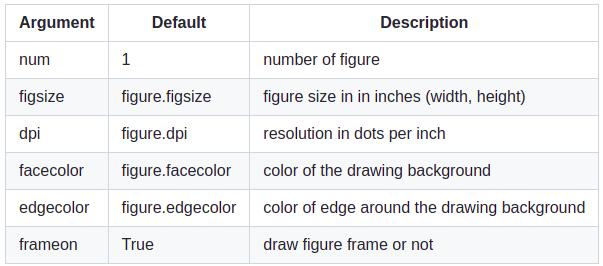

# Data Visualization

*Matplotlib is a comprehensive library for creating static, animated, and interactive visualizations in Python.*

### IPython and the pylab mode

IPython is an enhanced interactive Python shell, When we start it with the command line argument -pylab (--pylab since IPython version 0.12), it allows interactive matplotlib sessions that have Matlab/Mathematica-like functionality.

### pyplot

pyplot provides a convenient interface to the matplotlib object-oriented plotting library. It is modeled closely after Matlab.

## Simple Plots

### Using defaults

*Matplotlib comes with a set of default settings that allow customizing all kinds of properties. You can control the defaults of almost every property in matplotlib*

### Changing colors and line widths

`plt.figure(figsize=(10,6), dpi=80)`

`plt.plot(X, C, color="blue", linewidth=2.5, linestyle="-")`

`plt.plot(X, S, color="red",  linewidth=2.5, linestyle="-")`

### Setting Limits

`plt.xlim(X.min()*1.1, X.max()*1.1)`

`plt.ylim(C.min()*1.1, C.max()*1.1)`

### Setting ticks

`plt.xticks( [-np.pi, -np.pi/2, 0, np.pi/2, np.pi])`

`plt.yticks([-1, 0, +1])`

### Moving spines

*Spines are the lines connecting the axis tick marks and noting the boundaries of the data area. They can be placed at arbitrary positions and until now, they were on the border of the axis.*

`ax = plt.gca()`

`ax.spines['right'].set_color('none')`

`ax.spines['top'].set_color('none')`

`ax.xaxis.set_ticks_position('bottom')`

`ax.spines['bottom'].set_position(('data',0))`

`ax.yaxis.set_ticks_position('left')`

`ax.spines['left'].set_position(('data',0))`

## Figures, Subplots, Axes and Ticks

### Figures
*A figure is the windows in the GUI that has "Figure #" as title. Figures are numbered starting from 1 as opposed to the normal Python way starting from 0.*

### Subplots

*With subplot you can arrange plots in a regular grid. You need to specify the number of rows and columns and the number of the plot.*

### Axes 

*Axes are very similar to subplots but allow placement of plots at any location in the figure. So if we want to put a smaller plot inside a bigger one we do so with axes.*

## Animation

`# New figure with white background`

`fig = plt.figure(figsize=(6,6), facecolor='white')`

`# New axis over the whole figure, no frame and a 1:1 aspect ratio`

`ax = fig.add_axes([0,0,1,1], frameon=False, aspect=1)`

we will end up with this figure: 

`# Number of ring`

`n = 50`

`size_min = 50`

`size_max = 50*50`

`# Ring position`

`P = np.random.uniform(0,1,(n,2))`

`# Ring colors`

`C = np.ones((n,4)) * (0,0,0,1)`

`# Alpha color channel goes from 0 (transparent) to 1 (opaque)`

`C[:,3] = np.linspace(0,1,n)`

`# Ring sizes`

`S = np.linspace(size_min, size_max, n)`

`# Scatter plot`

`scat = ax.scatter(P[:,0], P[:,1], s=S, lw = 0.5,`
                  `edgecolors = C, facecolors='None')`

`# Ensure limits are [0,1] and remove ticks`

`ax.set_xlim(0,1), ax.set_xticks([])`

`ax.set_ylim(0,1), ax.set_yticks([])`

now the graph above will be animated and moving

## Other Types of Plots

## Why Can Matplotlib Be Confusing?

- The library itself is huge, at something like 70,000 total lines of code.
- Matplotlib is home to several different interfaces (ways of constructing a figure) and capable of interacting with a handful of different backends. 
- While it is comprehensive, some of matplotlib’s own public documentation is seriously out-of-date. The library is still evolving.

## Wrapping Up

As shown by some of the examples above, there’s no getting around the fact that matplotlib can be a technical, syntax-heavy library. Creating a production-ready chart sometimes requires a half hour of Googling and combining a hodgepodge of lines in order to fine-tune a plot.

However, understanding how matplotlib’s interfaces interact is an investment that can pay off down the road. 

