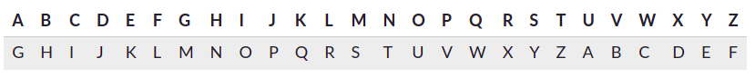

# Cryptography

## Caesar cipher

*In cryptography, a Caesar cipher, also known as Caesar's cipher, the shift cipher, Caesar's code or Caesar shift, is one of the simplest and most widely known encryption techniques.*

### Encrypting a message

Caesar's true message:

**SECRET MEETING AT THE PALACE**

what the encrypted message looks like:

**YKIXKZ SKKZOTM GZ ZNK VGRGIK**

To make the encrypted message above, I shifted the alphabet by 6 and used this substitution table:

### Decrypting a message

Imagine Caesar sends this message to a comrade:

**EHZDUH EUXWXV**

*The comrade uses this substitution table, where the alphabet is shifted by 3:*

They can then decode the message with certainty. The first letter "E" was shifted by 3 from "B", the second letter "H" was shifted by 3 from "E", etc. The result is this ominous message:

**BEWARE BRUTUS**

### Cracking the cipher

Enemies attempt to "crack" the cipher without knowing the shift.

**There are three main techniques he could use:**

1. Frequency analysis:

Human languages tend to use some letters more than others. For example, "E" is the most popular letter in the English language. We can analyze the frequency of the characters in the message and identify the most likely "E" and narrow down the possible shift amounts based on that.

2. Known plaintext:

If the enemy already knew some part of the plaintext, it will be easier for them to crack the rest of the encrypted version.

3. Brute force

There are only 25 possible shifts (not 26 — why not?). The enemy could take some time to try out each of them and find one that yielded a sensible message. They wouldn't even need to try the shifts on the entire message, just the first word or two.

## Encryption, decryption, and cracking

*we now understand the three key aspects of data encryption:*

- Encryption: scrambling the data according to a secret key (in this case, the alphabet shift).
- Decryption: recovering the original data from scrambled data by using the secret key.
- Code cracking: uncovering the original data without knowing the secret, by using a variety of clever techniques.

The encryption can also be represented using modular arithmetic by first transforming the letters into numbers, according to the scheme, A → 0, B → 1, ..., Z → 25. Encryption of a letter x by a shift n can be described mathematically as,

 `En(x)=(x+n) mod 26`

Decryption is performed similarly,

Dn(x)=(x-n) mod 26

## How to Encrypt and Decrypt Strings in Python?

- Import Fernet
- Then generate an encryption key, that can be used for encryption and decryption.
- Convert the string to byte string, so that it can be encrypted.
- Instance the Fernet class with the encryption key.
- Then encrypt the string with Fernet instance.
- Then it can be decrypted with Fernet class instance and it should be instanced with the same key used for encryption.

`from cryptography.fernet import Fernet`
 
`message = "hello geeks"`
 

`key = Fernet.generate_key()`
 

 
`fernet = Fernet(key)`

`encMessage = fernet.encrypt(message.encode())`
 
`print("original string: ", message)`

`print("encrypted string: ", encMessage)`
 

`decMessage = fernet.decrypt(encMessage).decode()`
 
`print("decrypted string: ", decMessage)`

