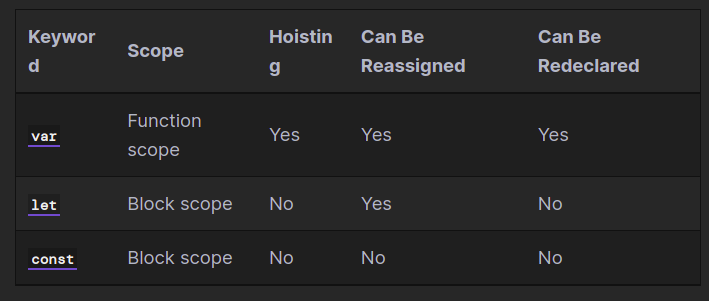

# React 1

## ES6 Syntax and Feature Overview

### Variables and constant feature comparison



### Variable declaration

*ES6 introduced the let keyword, which allows for block-scoped variables which cannot be hoisted or redeclared.*

**ES5**

`var x = 0`

**ES6**

`let x = 0`

### Constant declaration

`const CONST_IDENTIFIER = 0 // constants are uppercase by convention`

### Arrow functions

*The arrow function expression syntax is a shorter way of creating a function expression.*

```
let func = (a) => {} // parentheses optional with one parameter
let func = (a, b, c) => {} // parentheses required with multiple parameters
```

### Template literals

**String Interpolation:** `let str = Release Date: ${date}`

### Array iteration (looping)

```
for (let i of arr) {
  console.log(i)
}
```

### Spread syntax

```
let arr1 = [1, 2, 3]
let func = (a, b, c) => a + b + c

console.log(func(...arr1)) // 6
```

### Classes/constructor functions

```
class Func {
  constructor(a, b) {
    this.a = a
    this.b = b
  }

  getSum() {
    return this.a + this.b
  }
}

let x = new Func(3, 4)
```

### Inheritance

*The extends keyword creates a subclass.*

```
class Inheritance extends Func {
  constructor(a, b, c) {
    super(a, b)

    this.c = c
  }

  getProduct() {
    return this.a * this.b * this.c
  }
}

let y = new Inheritance(3, 4, 5)
```

### Promises

```
let doSecond = () => {
  console.log('Do second.')
}

let doFirst = new Promise((resolve, reject) => {
  setTimeout(() => {
    console.log('Do first.')

    resolve()
  }, 500)
})

doFirst.then(doSecond)
```

## Hello World In React

```
ReactDOM.render(
  <h1>Hello, world!</h1>,
  document.getElementById('root')
);
```

## Introducing JSX

**Why JSX?**

Instead of artificially separating technologies by putting markup and logic in separate files, React separates concerns with loosely coupled units called “components” that contain both. We will come back to components in a further section, but if you’re not yet comfortable putting markup in JS, this talk might convince you otherwise.

### Embedding Expressions in JSX

```
function formatName(user) {
  return user.firstName + ' ' + user.lastName;
}

const user = {
  firstName: 'Harper',
  lastName: 'Perez'
};

const element = (
  <h1>
    Hello, {formatName(user)}!
  </h1>
);

ReactDOM.render(
  element,
  document.getElementById('root')
);
```

### JSX is an Expression Too

*After compilation, JSX expressions become regular JavaScript function calls and evaluate to JavaScript objects.*

```
function getGreeting(user) {
  if (user) {
    return <h1>Hello, {formatName(user)}!</h1>;
  }
  return <h1>Hello, Stranger.</h1>;
}
```

### Specifying Children with JSX

```
const element = (
  <div>
    <h1>Hello!</h1>
    <h2>Good to see you here.</h2>
  </div>
);
```

### Rendering Elements

```
const element = <h1>Hello, world</h1>;
ReactDOM.render(element, document.getElementById('root'));
```

### Updating the Rendered Element

React elements are immutable. Once you create an element, you can’t change its children or attributes. An element is like a single frame in a movie: it represents the UI at a certain point in time.

```
function tick() {
  const element = (
    <div>
      <h1>Hello, world!</h1>
      <h2>It is {new Date().toLocaleTimeString()}.</h2>
    </div>
  );
  ReactDOM.render(element, document.getElementById('root'));
}

setInterval(tick, 1000);
```

## Components and Props

### Function and Class Components

*The simplest way to define a component is to write a JavaScript function:*

```
function Welcome(props) {
  return <h1>Hello, {props.name}</h1>;
}
```

*You can also use an ES6 class to define a component:*

```
class Welcome extends React.Component {
  render() {
    return <h1>Hello, {this.props.name}</h1>;
  }
}
```

### Rendering a Component


When React sees an element representing a user-defined component, it passes JSX attributes and children to this component as a single object. We call this object “props”.


```
function Welcome(props) {
  return <h1>Hello, {props.name}</h1>;
}

const element = <Welcome name="Sara" />;
ReactDOM.render(
  element,
  document.getElementById('root')
);
```

### Props are Read-Only

Whether you declare a component as a function or a class, it must never modify its own props. Consider this sum function:

```
function sum(a, b) {
  return a + b;
}
```
Such functions are called “pure” because they do not attempt to change their inputs, and always return the same result for the same inputs.

*In contrast, this function is impure because it changes its own input:*

```
function withdraw(account, amount) {
  account.total -= amount;
}
```

## State and Lifecycle

### Converting a Function to a Class

1. Create an ES6 class, with the same name, that extends React.Component.
2. Add a single empty method to it called render().
3. Move the body of the function into the render() method.
4. Replace props with this.props in the render() body.
5. Delete the remaining empty function declaration.

```
class Clock extends React.Component {
  render() {
    return (
      <div>
        <h1>Hello, world!</h1>
        <h2>It is {this.props.date.toLocaleTimeString()}.</h2>
      </div>
    );
  }
}
```

### Adding Local State to a Class

*Replace this.props.date with this.state.date in the render() method:*

`        <h2>It is {this.state.date.toLocaleTimeString()}.</h2>`

*Add a class constructor that assigns the initial this.state:*

```
constructor(props) {
    super(props);
    this.state = {date: new Date()};
  }

  render() {
    return (
        <h2>It is {this.state.date.toLocaleTimeString()}.</h2>
    );
  }
  ```

### React Lifecycle

In React, components go through a lifecycle of events:

- Mounting (adding nodes to the DOM)
- Updating (altering existing nodes in the DOM)
- Unmounting (removing nodes from the DOM)
- Error handling (verifying that your code works and is bug-free)

You can think of these events as a component’s birth, growth, and death, respectively. Error handling is like an annual physical.

Before rendering, the component will have gone through its mounting, updating, and unmounting phase. Let’s break it down further.

Mounting a component is like bringing a newborn baby into the world. This is the component’s first glimpse of life. At this phase, the component, which consists of your code and React’s internals, is then inserted into the DOM.

After the mounting phase, the React component “grows” during the updating phase. Without updates, the component would remain as it was when it was initially created in the DOM. As you might imagine, many of the components you write till need to be updated ,  whether via a change in state or props. Consequently, they go through the updating phase as well.

The final phase is called the unmounting phase. At this stage, the component “dies”. In React lingo, it is removed from  the DOM.

### State Updates May Be Asynchronous
React may batch multiple setState() calls into a single update for performance.

Because this.props and this.state may be updated asynchronously, you should not rely on their values for calculating the next state.

The correct way in writing them will be:

```
this.setState((state, props) => ({
  counter: state.counter + props.increment
}));
```

## Handling Events

Handling events with React elements is very similar to handling events on DOM elements. There are some syntax differences:

- React events are named using camelCase, rather than lowercase.
- With JSX you pass a function as the event handler, rather than a string.

### Passing Arguments to Event Handlers

```
<button onClick={(e) => this.deleteRow(id, e)}>Delete Row</button>
<button onClick={this.deleteRow.bind(this, id)}>Delete Row</button>
```

## Tailwind CSS

tailwindcss is a utility-first CSS framework packed with classes like flex, pt-4, text-center and rotate-90 that can be composed to build any design, directly in your markup.

Code example:

```
<style>
  .chat-notification {
    display: flex;
    max-width: 24rem;
    margin: 0 auto;
    padding: 1.5rem;
    border-radius: 0.5rem;
    background-color: #fff;
    box-shadow: 0 20px 25px -5px rgba(0, 0, 0, 0.1), 0 10px 10px -5px rgba(0, 0, 0, 0.04);
  }
  .chat-notification-logo-wrapper {
    flex-shrink: 0;
  }
  .chat-notification-logo {
    height: 3rem;
    width: 3rem;
  }
  .chat-notification-content {
    margin-left: 1.5rem;
    padding-top: 0.25rem;
  }
  .chat-notification-title {
    color: #1a202c;
    font-size: 1.25rem;
    line-height: 1.25;
  }
  .chat-notification-message {
    color: #718096;
    font-size: 1rem;
    line-height: 1.5;
  }
</style>
```

In the example above, we’ve used:

- Tailwind’s flexbox and padding utilities (flex, flex-shrink-0, and p-6) to control the overall card layout
- The max-width and margin utilities (max-w-sm and mx-auto) to constrain the card width and center it horizontally
- The background color, border radius, and box-shadow utilities (bg-white, rounded-xl, and shadow-md) to style the card’s appearance
- The width and height utilities (w-12 and h-12) to size the logo image
- The space-between utilities (space-x-4) to handle the spacing between the logo and the text
- The font size, text color, and font-weight utilities (text-xl, text-black, font-medium, etc.) to style the card text

### Why not just use inline styles?


using utility classes has a few important advantages over inline styles:

- **Designing with constraints**. Using inline styles, every value is a magic number. With utilities, you’re choosing styles from a predefined design system, which makes it much easier to build visually consistent UIs.
- **Responsive design**. You can’t use media queries in inline styles, but you can use Tailwind’s responsive utilities to build fully responsive interfaces easily.
- **Hover, focus, and other states**. Inline styles can’t target states like hover or focus, but Tailwind’s state variants make it easy to style those states with utility classes.

### Maintainability concerns
The biggest maintainability concern when using a utility-first approach is managing commonly repeated utility combinations.

This is easily solved by extracting components, usually as template partials or components.

```
<template>
  <button class="bg-blue-500 hover:bg-blue-700 text-white font-bold py-2 px-4 rounded">
    <slot/>
  </button>
</template>
```

## Next.js

To build a complete web application with React from scratch, there are many important details you need to consider:

- Code has to be bundled using a bundler like webpack and transformed using a compiler like Babel.
- You need to do production optimizations such as code splitting.
- You might want to statically pre-render some pages for performance and SEO. You might also want to use server-side rendering or client-side rendering.
- You might have to write some server-side code to connect your React app to your data store.

### Next.js: The React Framework

*Next.js aims to have best-in-class developer experience and many built-in features, such as:*

- An intuitive page-based routing system (with support for dynamic routes)
- Pre-rendering, both static generation (SSG) and server-side rendering (SSR) are supported on a per-page basis
- Automatic code splitting for faster page loads
- Client-side routing with optimized prefetching
- Built-in CSS and Sass support, and support for any CSS-in-JS library
- Development environment with Fast Refresh support
- API routes to build API endpoints with Serverless Functions
- Fully extendable


